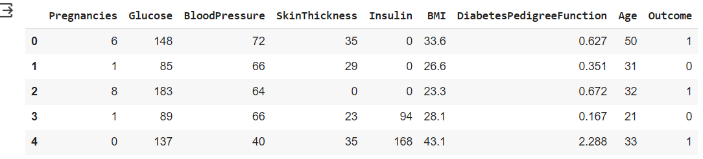

# Machine Learning
### Nama  : Doni Arafat
### Nim   : 211351049
### Kelas : Malam B

## Domain Proyek
Web App yang saya kembangkan ini bisa digunakan oleh siapapun yang membutuhkan. Hasil dari web app ini digunakan untuk mengidentifikasi apakah anda ( Perempuan) mengidap diabtes dengan menganalisa semua simptom-simptom yang sedang anda alami. Setelah mendapatkan hasil sebaiknya anda secepatnya pergi pada seorang profesional untuk diagnosa lebih lanjut dan melakukan pengobatan.

## Business Understanding
Bisa mengidentifikasi diabetes lebih cepat jika anda tidak memiliki waktu untuk konsultasi dengan seorang profesional

### Problem Statements
Menjelaskan pernyataan masalah latar belakang:
- Semakin meningkatnya kasus penderita diabetes di kalangan perempuan yang di dasari dari periode kehamilan,berat badan,faktor keturunan,usia dll

### Goals
Menjelaskan tujuan dari pernyataan masalah:
- Mencari cara agar orang-orang (Perempuan) bisa menggunakan suatu aplikasi untuk mengidentifikasi apakah mereka mengidap diabetes atau tidak dengan cara menginputkan simptom simptom yang dia alami.

## Data Understanding
Datasets yang saya gunakan berasal dari Kaggle, dari user mr gyanashish, Dataset ini bernama healthcare-diabetes dengan 9 jumlah kolom dan 768 baris data 

[healthcare-diabetes] (https://www.kaggle.com/datasets/gyanashish/healthcare-diabetes)

### Variabel-variabel pada healthcare-diabetes Dataset adalah sebagai berikut:
• Pregnancies  : Adalah status frekwensi kehamilan (Int)
• Glucose : Adalah status Kadar gula saat test oral (Int)
• BloodPressure (mm Hg) : Adalah status Tekanan darah diastolik (Int)
• SkinThickness (mm) : Adalah status Ketebalan kulit / lipatan trisep (Int)
• Insulin  : Adalah status Insulin serum 2 jam (Int)
• BMI : Adalah status Berat masa Index (Float)
• DiabetesPedigreeFunction : Adalah status pengaruh Faktor keturunan (Float)
• Age : Adalah status Umur dalam Tahun (Int)


## Data Preparation
Untuk teknik yang saya gunakan disini adalah Exploratory Data Analyze (EDA)

 langkah pertama adalah mengimpor file token kaggle agar bisa mengambil datasets yang telah dipilih,
``` bash
from google.colab import files
files.upload()
```
Lalu membuat folder untuk menampung file yang tadi dimasukkan dan mengunduh datasets yang kita inginkan,
``` bash
!mkdir -p ~/.kaggle
!cp kaggle.json ~/.kaggle/
!chmod 600 ~/.kaggle/kaggle.json
!ls ~/.kaggle

!kaggle datasets download -d gyanashish/healthcare-diabetes
```
Setelah mengunduh datasetsnya, kita akan meng-unzipnya agar kita bisa menggunakan file csvnya,
``` bash
!unzip healthcare-diabetes -d healthcare-diabetes
!ls healthcare-diabetes
```
Langkah selanjutnya adalah mengimpor semua komponen yang akan digunakan selama proses EDA,
``` bash
import pandas as pd
import numpy as np
import matplotlib.pyplot as plt
import seaborn as sns
```
Mari gunakan datasets yang tadi telah diekstrak dengan menggunakan read_csv dari pandas,
``` bash
df = pd.read_csv('/content/healthcare-diabetes/health care diabetes.csv')
```

Kemudian kita tampilkan data top 5 
```
df.head()
```



Kemudian kita tampilkan info ringkas data frame
```
df.info()
```
Kemudian kita tampilkan statistik deskriptif ringkas tentang kolom-kolom numerik dalam DataFrame. Statistik yang dihasilkan mencakup count (jumlah data non-null), mean (rata-rata), std (standar deviasi), min (nilai minimum), 25% (kuartil pertama), 50% (median atau kuartil kedua), 75% (kuartil ketiga), dan max (nilai maksimum).

df.describe()
```
Kemudian kita tranposisikan data agar lebih mudah melihat hasil dari statistik nya
```
df.describe().T
```
Kemudian kita tampilkan kolom dan baris pada data
```
df.shape
```

Kemudian kita menghitung jumlah nilai null (NaN atau missing values) di setiap kolom dari DataFrame. Ini memberikan informasi tentang seberapa banyak data yang hilang dalam setiap kolom.
```
df.isnull().sum()
```

Kemudian kita menghitung jumlah nilai null (NaN atau missing values) di setiap kolom DataFrame. Metode ini memberikan informasi tentang seberapa banyak data yang hilang dalam setiap kolom.
df['Outcome'].value_counts()
```

Kemudian kita membuat grafik histogram untuk mengetahui sebaran data dari setiap variable
p = df.hist(figsize = (20,20))
```

Kemudian kita membuat metrik relasi yang bertujuan untuk melihat hubungan antar variable
correlation_matrix = df.corr()
plt.figure(figsize=(12, 10))
sns.heatmap(correlation_matrix, annot=True, cmap='coolwarm', fmt=".2f")
plt.title('Correlation Matrix')
plt.show()
```

Kemudian kita membuat count plot dari tipe data dalam DataFrame menggunakan Seaborn (sns). Ini membantu kita memahami distribusi tipe data di seluruh kolom DataFrame. 
sns.countplot(y=df.dtypes ,data=df)
plt.xlabel("count of each data type")
plt.ylabel("data types")
plt.show()
```

Kemudian kita gunakan bar untuk memvisualisasikan nilai-nilai yang hilang (missing values) dalam suatu DataFrame.
p=msno.bar(df)
```

Kemudian kita membuat diagram batang (bar plot) dengan menggunakan library pandas untuk DataFrame df dengan memberi warna dan menjelaskan sebaran data nya
color_wheel = {1: "#0392cf",
               2: "#7bc043"}
colors = df["Outcome"].map(lambda x: color_wheel.get(x + 1))
print(df.Outcome.value_counts())
p=df.Outcome.value_counts().plot(kind="bar")
```

## Processing
Kita melakukan penskalaan standar (standard scaling) pada fitur-fitur dalam DataFrame df. Ini dilakukan dengan menggunakan StandardScaler dari scikit-learn. 
from sklearn.preprocessing import StandardScaler
sc_X = StandardScaler()
X =  pd.DataFrame(sc_X.fit_transform(df.drop(["Outcome"],axis = 1),),
        columns=['Pregnancies', 'Glucose', 'BloodPressure', 'SkinThickness', 'Insulin',
       'BMI', 'DiabetesPedigreeFunction', 'Age'])
```

kemudian mencoba kembali untuk melihat beberapa baris pertama dari DataFrame X. Fungsi head() digunakan untuk menampilkan beberapa baris teratas dari DataFrame.
X.head()
```

## Modeling
Kita menggunakan train_test_split dari scikit-learn untuk membagi dataset menjadi set pelatihan dan pengujian. 
from sklearn.model_selection import train_test_split
X_train,X_test,y_train,y_test = train_test_split(X,y,test_size=1/3,random_state=42, stratify=y)
```

Kemudian kita gunakan untuk melatih model K-Nearest Neighbors (KNN) dengan berbagai nilai k dan mengumpulkan skor pelatihan dan pengujian untuk masing-masing nilai k
from sklearn.neighbors import KNeighborsClassifier


test_scores = []
train_scores = []

for i in range(1,15):

    knn = KNeighborsClassifier(i)
    knn.fit(X_train,y_train)

    train_scores.append(knn.score(X_train,y_train))
    test_scores.append(knn.score(X_test,y_test))
    ```

    Kemudian kita gunakan untuk menemukan nilai k yang memberikan skor pelatihan tertinggi.
    max_train_score = max(train_scores)
train_scores_ind = [i for i, v in enumerate(train_scores) if v == max_train_score]
print('Max train score {} % and k = {}'.format(max_train_score*100,list(map(lambda x: x+1, train_scores_ind))))
```

Kemudian kita mencari nilai k yang memberikan skor pengujian tertinggi.
max_test_score = max(test_scores)
test_scores_ind = [i for i, v in enumerate(test_scores) if v == max_test_score]
print('Max test score {} % and k = {}'.format(max_test_score*100,list(map(lambda x: x+1, test_scores_ind))))
```

## Evaluasi
Kemudian kita membuat model K-Nearest Neighbors (KNN) dengan menggunakan nilai k yang diberikan (dalam kasus ini, k=1), melatihnya dengan data pelatihan, dan menghitung skor pada data pengujian
knn = KNeighborsClassifier(1)

knn.fit(X_train,y_train)
knn.score(X_test,y_test)
```

Kemudian kita membuat confusion matrix dan menampilkannya sebagai heatmap dengan menggunakan Seaborn. 
y_pred = knn.predict(X_test)

cnf_matrix = metrics.confusion_matrix(y_test, y_pred)
p = sns.heatmap(pd.DataFrame(cnf_matrix), annot=True, cmap="YlGnBu" ,fmt='g')
plt.title('Confusion matrix', y=1.1)
plt.ylabel('Actual label')
plt.xlabel('Predicted label')
```
Kita mencetak laporan klasifikasi yang menyediakan beberapa metrik evaluasi tambahan untuk model klasifikasi
print(classification_report(y_test,y_pred))

dan di dapat accuracy 0.72
```

## Deployment
https://prediksi-diabetes-uas.streamlit.app/
